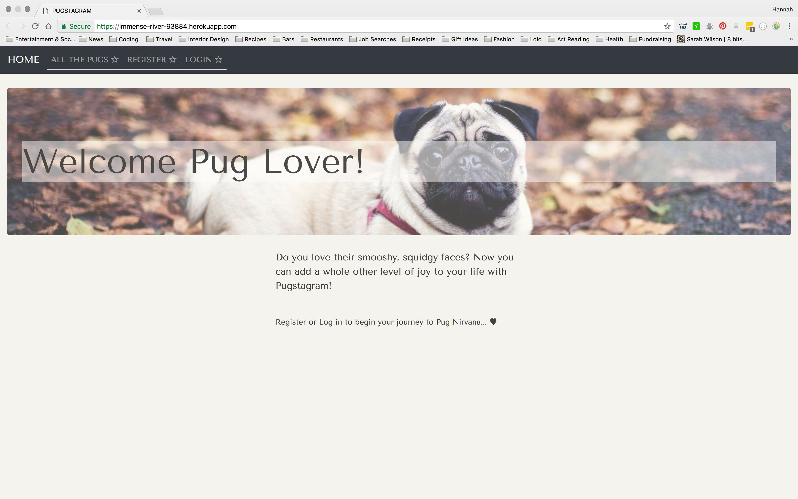
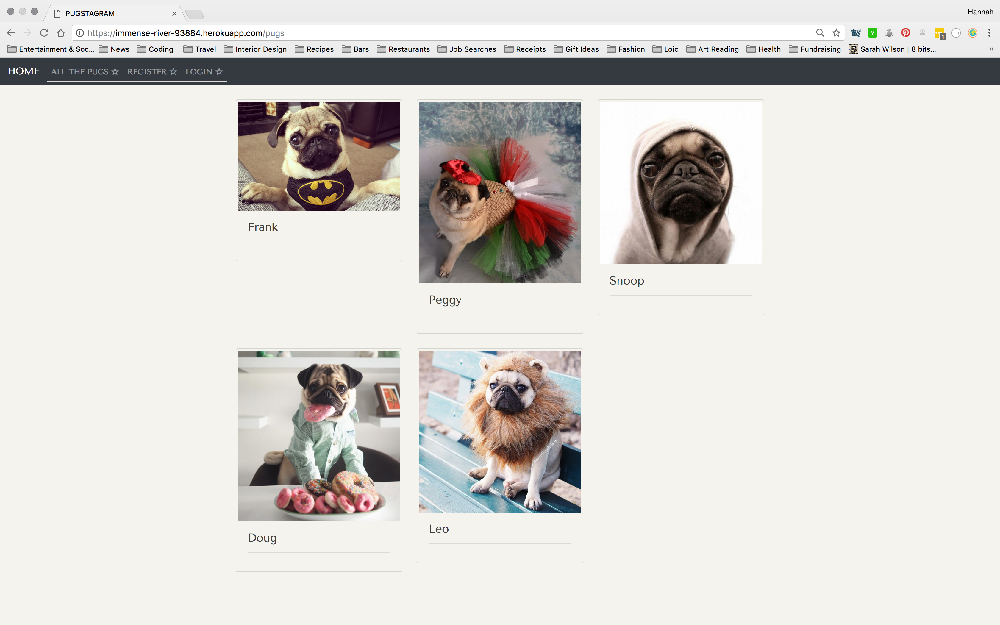
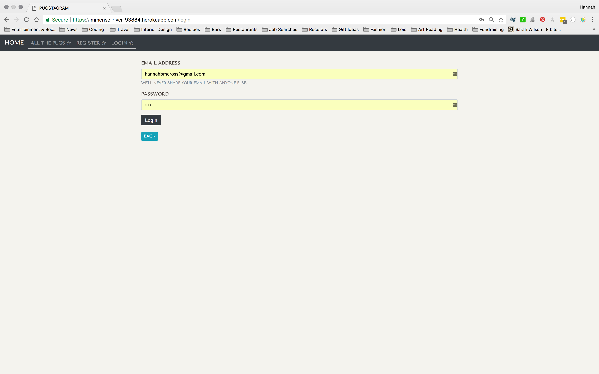
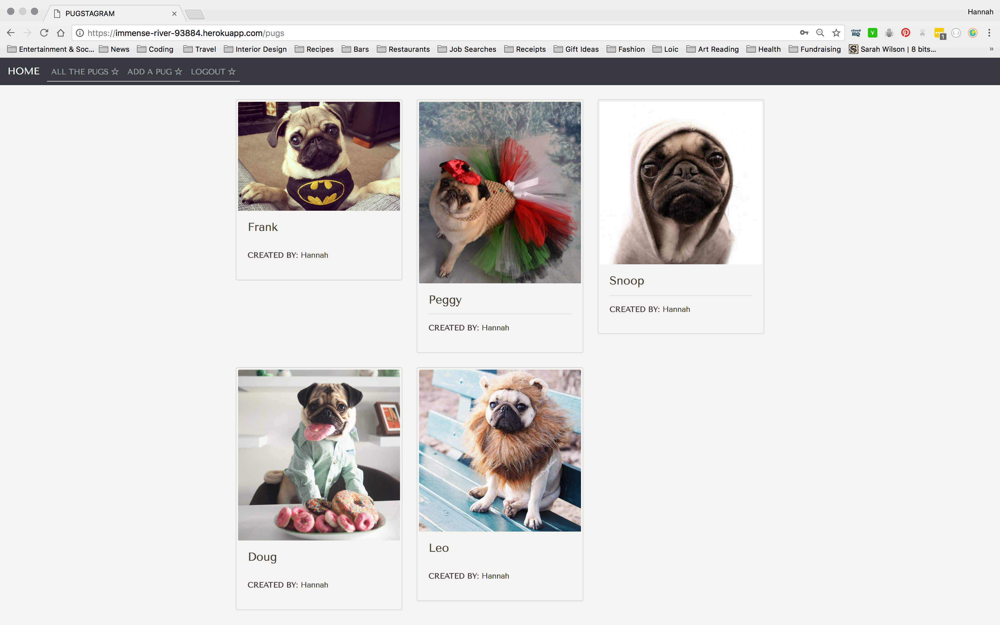
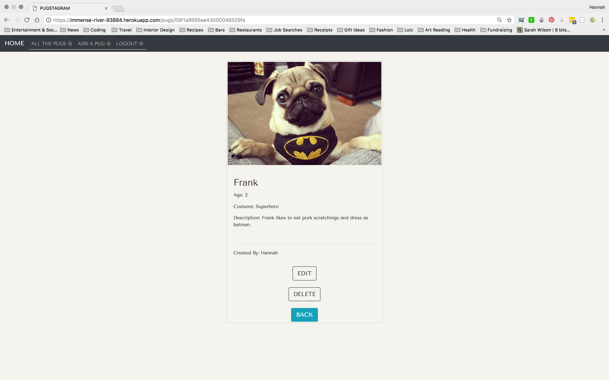
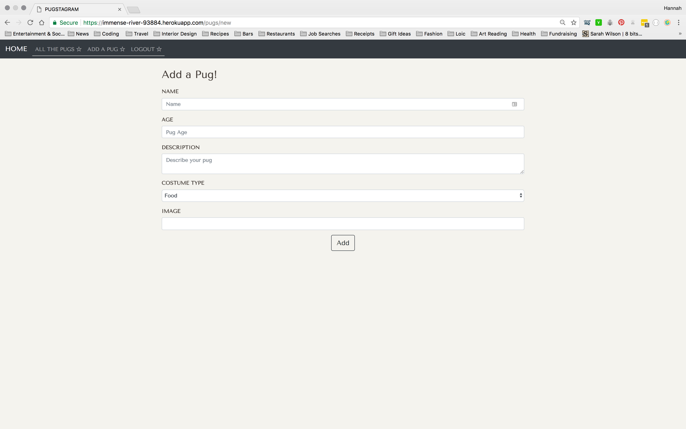

<h1>WDI PROJECT 2</h1>

For my second project, the brief was to create an app using MongoDB, Express and Node.js which had secure authentication as a key feature.

I decided to combine two of my favourite things; instagram and pugs. This is how "Pugstagram" was born!

<h3>How it works</h3>

I set up the app so that when you first land on the url, the home page welcomes you and explains what the website is about. There are also options in the nav bar to

* see all pugs
* register an account
* log in to your account

However, until you are logged in you do not have the ability to see all the details of each pug or edit/delete the pug.

<h3>Working with authentication</h3>
The log in authentication is a basic one, using express session but proved to be quite challenging as a first forray into secure login process.

I was very pleased when I was able to successfully log in and out of the website and show and hide buttons in the nav bar and on forms depending on user status.

<h3>Styling</h3>
I enjoyed the styling process a lot, however as with most of the work during the course so far I have found that I never have enough time to style a site as I would like to. I am still learning how to write clean and efficient CSS - I continue to aim to keep the mark-up as simple as possible whilst still producing a strong and effective layout.

<h2>Screenshots</h2>

